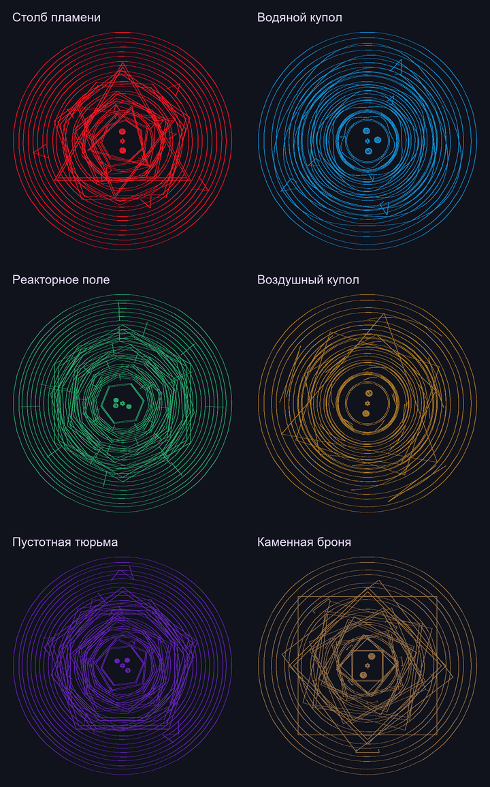

# ManaTech

Мод для **Minecraft 1.21.1 / NeoForge**, соединяющий рисование магических кругов, ману и технику.

Игрок рисует отдельные слои, сохраняет их на страницах и собирает составное заклинание на столе наложения. Гримуар хранит независимый снимок рисунков и их порядка.

**Текущая версия: 0.14.1. Проект находится в разработке.**

## Что уже работает

- Редактор с направляющими для шести стихий и двенадцати слоёв. После замыкания можно дорисовывать все части схемы.
- Стол наложения: библиотека страниц, свободное размещение, поворот, масштаб, порядок и автоматическое выравнивание.
- Гримуар с готовыми сборками и каталогом **134 схем**, просмотром страниц и общего наложения.
- Самостоятельный каст и **21 форма Огня I–VI кругов**. Остальные специальные эффекты ещё разрабатываются; наличие схемы не означает готовый эффект.
- Уровни и ранги игрока, поглощение маны, вертикальный синий сосуд и сокращённые числа `k / m / b / t / qa / qi`.
- Магикамни шести стадий, новые металлы и руды, ручная огранка без расхода маны.
- Адамантиевая печь 4×4×4 с четырьмя каналами, стоками и интерфейсом; краткий гайд Patchouli.

Визуальные эффекты пока являются прототипами. Исследования символов, дальнейшая техника и парящие острова остаются частью плана.

## От рисунка до заклинания

1. Откройте стол начертания стилусом, выберите стихию и слой. Нарисуйте контур и поставьте **Создание в центр**. `Ctrl+Z` отменяет штрих, `V` показывает другие слои.
2. Экспортируйте страницу и загрузите её в библиотеку стола наложения. Предмет передаётся столу; при разрушении стола страницы выпадают обратно.
3. Пустой рукой откройте стол. Добавьте все нужные страницы снизу вверх. Повторное использование рисунка в сборке не расходует дополнительные страницы; копии не заменяют пропущенный номер.
4. Нажмите **«Выровнять»** или настройте размещение вручную. ПКМ гримуаром по столу сохраняет снимок сборки.
5. Выберите заклинание в гримуаре. `Shift+ПКМ` в воздух — каст; ПКМ по мановой пластине — круг в мире.

| Круг | Обязательные слои | Всего |
|---|---|---|
| I | 1–2 | 2 |
| II | 1–3 | 3 |
| III | 1–5 | 5 |
| IV | 1–7 | 7 |
| V | 1–9 | 9 |
| VI | 1–10 | 10 |
| VII | 1–12 | 12 |

Каждая страница требует Создание и замкнутый контур вокруг него. Доступ к слоям определяется меньшим уровнем стилуса и стола, доступ к касту — рангом игрока. Внешние слоты стилусов I–VII: **2 / 3 / 4 / 5 / 6 / 8 / 8**, центр отдельно.

При первом входе выбирается уровень 1–11. Запас маны растёт по рангам на основе `128^ранг`; `1/30` поглощённой маны также идёт в развитие. Пассивное восстановление — **0,5% максимума в секунду**.

## Требования

| Компонент | Версия |
|---|---|
| Minecraft | 1.21.1 |
| NeoForge | 21.1.217 |
| Java / JDK | 21 |
| GeckoLib | 4.9.3+ |
| Patchouli | 1.21.1-93+ для NeoForge |
| LDLib2 | 2.2.40+ для NeoForge 1.21.1, клиент |
| Photon | 2.2.7+ для NeoForge 1.21.1, клиент |

Для игры установите JAR ManaTech и соответствующие зависимости в папку `mods`. Библиотеки не включены внутрь JAR мода.

## Сборка

Нужен JDK 21. Gradle запускается через wrapper. LDLib2 и Photon для разработки лежат в `libs/`; остальные зависимости Gradle загружает автоматически.

**Windows / PowerShell:**

```powershell
./tools/build-local.ps1
```

**Прямой запуск wrapper:**

```sh
./gradlew -I tools/local-build.init.gradle build
```

Результат: `build-verify-3/libs/manatech-0.14.1.jar`. Используется существующая папка `build-verify-3` внутри проекта, в том числе при работе из OneDrive. Кэши, игровые запуски и результаты сборки исключены из Git.

## Документация

- [Текущее состояние](CURRENT_STATE.md) — актуальные решения и контекст продолжения.
- [Ход реализации](BUILD_PROGRESS.md) — выполненные этапы и проверки.
- [Правила кругов и слоёв](CIRCLE_LAYER_RULES.md).
- [Каталог схем](SPELL_SCHEMATICS.md).
- [Концепция магии](MAGIC_CONCEPT.md).
- [Визуальные ориентиры](DESIGN_REFERENCES.md).

Исходники — `src/main/java`, ресурсы — `src/main/resources`, инструменты — `tools`. Модели и превью хранятся в `art`, предоставленные референсы — в `references`.

<details>
<summary>Превью наложения схем</summary>



</details>

## Лицензия

В метаданных проекта указано **All Rights Reserved**. Сторонние библиотеки сохраняют собственные лицензии.
